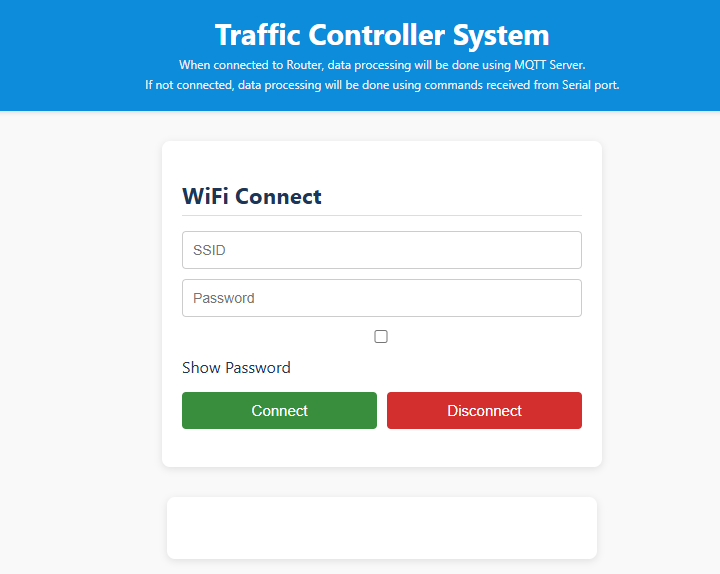
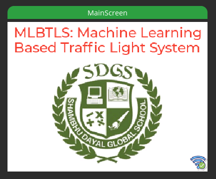
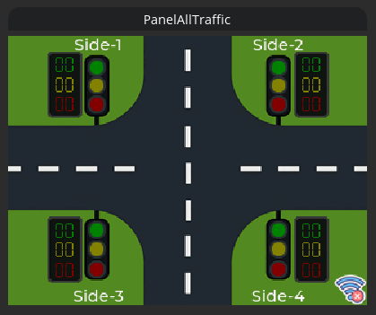

# MLBTLS: Machine Learning Based Traffic Light Control System
MLBTS system is a control system developed using Computer Vision and Machine Learning based car detection program running using Python Application, to dynamically adjust control the traffic flow.  
This system controls the traffic flow at an intersection of a road, where `Side-1` timing is dynamically updated based on the number of cars detected by camera. The time increases by 1 second per car and upto a maximum of 10 seconds, but all of this is configurable inside the project.

The project consist of two main components, and they are as below.
* Python Application
* ESP32 Controller

### Python Application
Python application uses the camera connected with Open Source Computer Vision library and Machine Learning data to count the number of cars, and then this information is sent to serial port and free eclipse MQTT server. The following python modules are used for this project.
1. **CV2**: Open Source Computer Vision Library to capture the images from camera and count number of detected cars on Side-1.

2. **time**: This is default Python's time module/library and is used to timing calculations.

3. **imutils**: This module is a sort of helper module for Open Source Computer Vision library to enhance its functionality.

4. **Py-Serial**: This module is used to send the timing information and signal information to ESP32 module using Serial Communication (UART) interface.

5. **Paho MQTT**: This module is used to send data to free MQTT Server, this is used in case someone wants to use the wireless capabilities. (**NOTE: Internet is required for this**)

#### Python Application Working
When the Python application is started, it confgures the `Paho MQTT` library to connect with the free MQTT server `test.mosquitto.org` on port `1883`, once the connection is established, the selected serial communication port is opened for communication with ESP32. Please update the following lines according to your setup.  
```python
port = 'COM4'  # Change this to your actual port
```
The next step is to initialize and open the USB cameara connected to the USB port of the Laptop, and this is done using the following piece of code in Python Application. Make sure to update the `camera_number` variable according to your setup, as shown below.
```python
# Opening the Camera
camera_number = 1 # Change this to your camera number
print (f"Opening camera number: {camera_number}")
# Initialize the video capture
# Use cv2.CAP_DSHOW for Windows to avoid camera issues
cap = cv2.VideoCapture(camera_number, cv2.CAP_DSHOW)
if not cap.isOpened():
    print ("Error: Could not open video.")
    exit()

print ("Camera Sensor Warming Up")
time.sleep(2.0)  # Allow the camera to warm up
```
The next step in the Python Application is to initialize the Open Source Computer Vision library with the training data for cars detection, this is done using the following piece of code. One can update the `*.xml` file in case someone has a better version of the training data.
```python
# Using OpenCV Cascade Classifier to detect cars
car_cascade = cv2.CascadeClassifier('cars.xml')
```
And then the next step is to capture the images using the camera, and then Open Source Computer Vision Library detects the number of cars on Side-1, and based on this information a message is sent over serial port to ESP32 module and also to free MQTT server. The message is sent in the following format.  
```
<0:G10,1:R13,2:R26,3:R39>
```
The following is the packet format:
* **'<'**: Identifier for start of packet
* **0:G10,**: This is the data for first side, here `0` means first side, `G` means Green Signal and `10` means 10 seconds, so this message indicates that Side-0 has Green Signal for 10 seconds. Same format is used for other sides.
* **'>'**: Identifier for end of packet

These messages with signal information and timing information are sent to ESP32 module over serial communication and MQTT server every 1 second with updated information. The following is the flow of messages for some seconds.
```
<0:G10,1:R13,2:R26,3:R39>
<0:G09,1:R12,2:R25,3:R38>
<0:G08,1:R11,2:R25,3:R37>
<0:G07,1:R10,2:R24,3:R36>
and so on
```

### ESP Application
ESP32 Application is quite complex and is doing several activities. When ESP32 is powered-up it initializes and configures itself to handle both serial data and also data over MQTT server, by default data from MQTT server has priority and if ESP32 is not connected to Internet and MQTT server, Serial data is considered for display updates.

The following are the parallel tasks running on ESP32 to handle various things.
1. **HTTP Server Task**: HTTP Server Task configures the ESP32 in Access Point mode and host a web-server as shown below.
  

  This page can be accessed by connecting with the Access Point `ESP_AP` with Password `1122334455` and once the connection is successful, by opening the IP Address `192.168.0.1`.
  From this page one can connect to the Router by entering the `SSID` and `Password` information, and once this is successful and validated, the Python Application and ESP32 works using MQTT Server and no need to connect both of them on same laptop, this can work from distant location all over the world.

2. **Graphical Management Task**: This task takes care of all the stuff regarding displaying data on the TFT screen. When ESP32 is powered-up the following page is displayed.

  
  This page display the project title and school logo and at the botto right cornet one can see a small icon, this indicates whether ESP32 is connected with the MQTT server or not, if not connected then Serial Data will be used for display update.

  Once MQTT connection is established or Serial Connection is established, the following screen is displayed.

  
