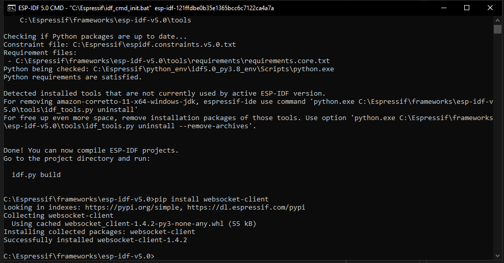

ESP-IDF Hello World
====================

This is a simple example to toggle an LED and print some data on the serial port.

The project builds fine but while working on this I was facing a problem, when I tried to open the `Terminal` inside the Eclipse IDE.

The problem is more or less similar to the one mentioned below.

[Websocket-Client Installation Missing](https://github.com/espressif/idf-eclipse-plugin/issues/496)

And to fix the issue, we have to install the `websocket-client` package but from the `ESP-IDF` `Python` installation. For this we have to open the `ESP-IDF CMD` or `ESP-IDF Power Shell`.

