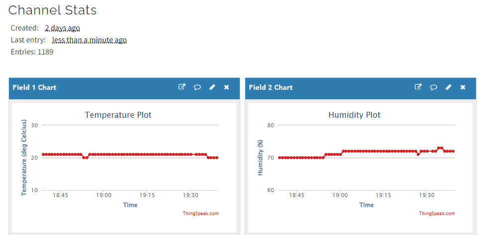
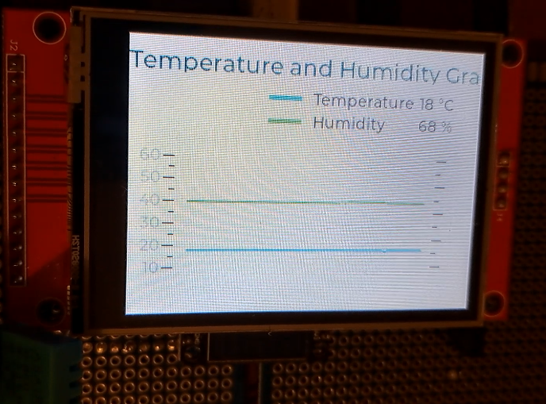
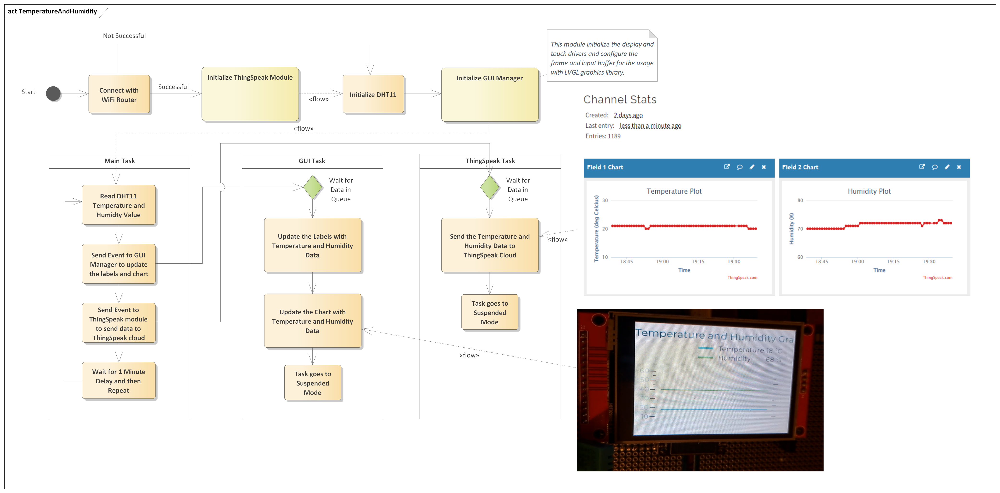
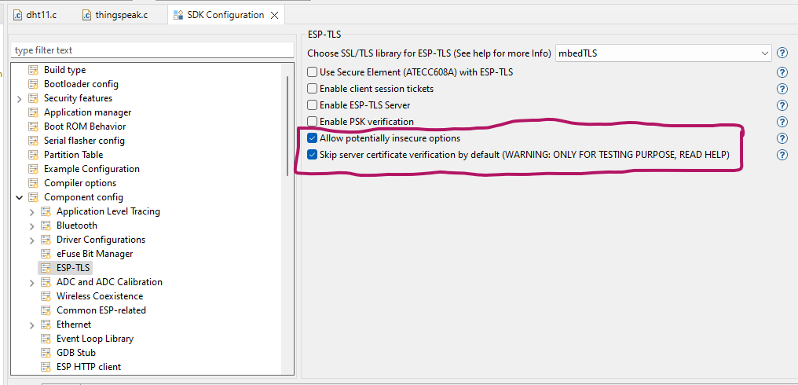

Visualize Temperature and Humidity Data on Display and ThingSpeak Using ESP-IDF
====================

<!-- ](docs/pcbway.png) -->
<a href="https://pcbway.com/g/a8XEUi"></a>

In this post, I will demonstrate how we can use the ESP32 module to sense the temperature and humidity data from the DHT11 sensor and then display this data on the ILI9341-based display module and also send this data to ThingSpeak cloud for visualization.  
For visualization on the display, I am using the LVGL library, and to send data to the ThingSpeak cloud, I am using the ESP-IDF IOT Framework, not the Arduino.  



</a>

Click on this linke to watch video on YouTube: [YouTube Video](https://www.youtube.com/watch?v%3DZVSL4IXyavU)

## Prerequisite for this Tutorial
* ESP32 Board
* DHT11 Sensor
* ILI9341 Based Display
* Some Cables

The following is the Activity Diagram illustrating the software module arrangements.  
  

## What is ThingSpeak?
ThingSpeak is an IoT platform for data collection and analytics that serves as a bridge connecting edge node devices such as temperature, humidity, pressure, etc. sensors to collect data and data exploratory analysis software to analyze data.  
ThingSpeak serves as the data collector which collects data from edge node devices (ESP32 in this case) and also enables the data to be pulled into a software environment for historical data analysis.  
The primary element of ThingSpeak activity is the channel, which contains data fields, location fields, and a status field. After you create a ThingSpeak channel, you can write data to the channel, process and view the data with MATLAB code (which is not the scope of this post), and react to the data with tweets and other alerts.  
The typical ThingSpeak workflow lets you:  
* Create a Channel and collect data
* Analyze and Visualize the data
* Act on the data using any of several Apps.

I am not going to tell you how to create an account on ThingSpeak, it's a very trivial process, and you just need to create an account using your email ID, and then create a channel with two fields, here I created two fields, one for temperature and another for humidity, in case you are using some other sensor, you can update the fields accordingly.  
So in the post, we will measure the temperature and humidity values using a DHT11 sensor with the help of an ESP32 module and then send these values to the ThingSpeak channel, by doing this you can see the temperature and humidity values of your home from any corner of the world using ThingSpeak.  
Locally we will also display the temperature and humidity data in the form of labels and graphs on TFT display.  

## Interfacing with DHT11 Sensor
As a first step, we will use the ESP32 to capture the temperature and humidity information from the DHT11 temperature sensor. So, for this I have created a software library "dht11", you can use this, or alternatively you can use any other software library, and update the software accordingly.  
The library prepared is very straightforward to use, the following are the functions to initialize and get the temperature and humidity information.  
```C
// initialize dht sensor library
dht11_init(DHT11_PIN, false);
// Get DHT11 Temperature and Humidity Values, when the status is DHT11_OK
dht11_read().status
dht11_read().humidity;    // Get Temperature
dht11_read().temperature; // Get Humidity
```

## Initializing the Display SW Module
The next step is to initialize the display module, which is very well handled by using multiple software modules such as `display_mng`, `ili9341`, `xpt2046` and `gui_mng`.  
Here the idea of creating multiple modules is to make software modular in nature, from the application point of view, we just need to update the "gui_mng" module to get something displayed on the TFT screen, the rest of the files are used to achieve the modularity. The following lines explain the purpose of each software module.  

* ILI9341: This module contains the drivers for the ILI9341 display controller, if your project doesn't use this display controller then you have to update your drivers accordingly.
* XPT2046: This module contains the drivers for the XPT2046 resistive touch controller, as of now this is not used in our project, but it is functional, and in my upcoming posts, I will show you some examples that use this also.
* Display Manager: This module contains the actual code to send data to the ILI9341 controller and XPT2046 controller, this module implements the SPI communication interface and configures the LVGL graphics library display drivers and input drivers, and then this module also starts the GUI manager task.
* GUI Manager: This is a software module that is exposed to the application code, all the graphics-related things will be implemented and handled here. For example, if we want to update some screen, we will handle this in this module only, by doing this we will make our code modular and easy to handle, and this is done using FreeRTOS Queues, so whenever we want to update something, we will just post an event from the main application code, and GUI manager will update the corresponding screen accordingly.  

The following are the important functions of the GUI manager module.
```C
// start the gui task, this handles all the display related stuff
gui_start();
// trigger event to display temperature and humidity
gui_send_event(GUI_MNG_EV_TEMP_HUMID, NULL );
```

## Initializing the ThingSpeak SW Module
The ThingSpeak software module is used to send the data to the ThingSpeak cloud, this module is very simple and it uses the ESP-IDF IOT framework libraries to send HTTP Client GET requests with the temperature and humidity values, which are then received by ThingSpeak cloud and visualized on the dashboard.  
To use this module, we have to first get connected with the WiFi router so that we can access the internet, if our connection is successful, then the ThingSpeak start API is called, which then starts the ThingSpeak task. To make our software development modular, just like in the GUI manager task, here also we used a queue to send events to the ThingSpeak module, and whenever the event is posted the ThingSpeak task, based on the event received, sends the data to the ThingSpeak cloud, this is done to make things modular and scalable for future updates.  
The two important public APIs are as below.
```C
void thingspeak_start( void );
BaseType_t thingspeak_send_event( thingspeak_event_t event, uint8_t *pData );
```

The first API i.e. the start API is used to create a FreeRTOS queue and start the ThingSpeak task, and the send event API is used to send the event to the ThingSpeak task.  
Whenever the event is received, the ThingSpeak task parses the received event and then takes action based on the received event. In our case, we are sending the event to send the Temperature and Humidity data to the ThingSpeak cloud, as shown below.  
```C
// if wifi is connected, trigger the event to send data to ThingSpeak
if( wifi_connect_status )
{
  thingspeak_send_event(THING_SPEAK_EV_TEMP_HUMID, NULL);
}
```

And then how the event is received from the Queue is shown below.
```C
static void thingspeak_task( void *pvParameters )
{
  thingspeak_q_msg_t msg;

  while( 1 )
  {
    // Wait for events posted in Queue
    if( xQueueReceive(thingspeak_event, &msg, portMAX_DELAY) )
    {
      // the below is the code to handle the state machine
      if( THING_SPEAK_EV_NONE != msg.event_id )
      {
        switch( msg.event_id )
        {
          case THING_SPEAK_EV_TEMP_HUMID:
            thingspeak_send_temp_humidity();
            break;
          default:
            break;
        } // switch case end
      }   // if event received in limit end
    }     // xQueueReceive end
  }
}
```
As you can see we are calling the function `thingspeak_send_temp_humidity` function, and this function contains the actual implementation of sending the temperature and humidity data to the ThingSpeak cloud, and its implementation is as below.  

```C
/**
 * @brief Send Temperature and Humidity data to ThingSpeak cloud
 * @param  none
 */
static void thingspeak_send_temp_humidity(void)
{
  esp_err_t err;
  uint8_t temperature = 0;
  uint8_t humidity = 0;
  char thingspeak_url[200];

  sensor_data_t *sensor_data = get_temperature_humidity();
  size_t idx = sensor_data->sensor_idx;
  if( (idx > 0) && (idx <= SENSOR_BUFF_SIZE) )
  {
    // before posting the event we have incremented the index and hence to get
    // the last sensor data we have to use - 1
    idx = (idx - 1);
    temperature = sensor_data->temperature[idx];
    humidity = sensor_data->humidity[idx];
  }
  else if( idx == 0 )
  {
    temperature = sensor_data->temperature[SENSOR_BUFF_SIZE-1];
    humidity = sensor_data->humidity[SENSOR_BUFF_SIZE-1];
  }

  snprintf( thingspeak_url, sizeof(thingspeak_url), "https://api.thingspeak.com/update?api_key=%s&field1=%u&field2=%u", THINGSPEAK_KEY, temperature, humidity);
  esp_http_client_config_t config =
  {
    .url = thingspeak_url,
    .method = HTTP_METHOD_GET,
    // todo: maybe for future
    // .transport_type = HTTP_TRANSPORT_OVER_SSL,   // Specify transport type
    // .crt_bundle_attach = esp_crt_bundle_attach,  // Attach the certificate bundle
  };

  esp_http_client_handle_t client = esp_http_client_init( &config );
  // set header
  esp_http_client_set_header( client, CLIENT_KEY, CLIENT_VALUE );
  ESP_LOGI(TAG, "ThingSpeak URL = %s", thingspeak_url);  
  // perform the request
  err = esp_http_client_perform(client);
  if (err == ESP_OK)
  {
    int status_code = esp_http_client_get_status_code(client);
    if( status_code == 200 )
    {
      ESP_LOGI(TAG, "Message Sent Successfully.");
    }
    else
    {
      ESP_LOGE(TAG, "Message Sending Failed.");
    }
  }
  esp_http_client_cleanup(client);
}
```

As can be seen from the above code, first we get the temperature and humidity data from the buffers and then send this data using an HTTP Client GET request.  
The code is designed in such a way that it can handle multiple events and send multiple data to the ThingSpeak cloud.  
To not face any problems, please make sure that in the SDK Config, then in the `ESP-TLS` setting, the `Allow potentially insecure options` and `Skip server certificate verification by default` are checked, as shown below.  



## Final
Now, let's see the main program or let's say the main task, which handles the connection with the WiFi router, getting the temperature and humidity data from the sensor, and then posting the events to the GUI manager and the ThingSpeak module, so that the GUI manager can update the labels with the latest available values, and the ThingSpeak module can send this data to the ThingSpeak cloud.  
The source code for this module is as below.  

```C
#include <stdio.h>
#include <stdbool.h>
#include <unistd.h>
#include "driver/gpio.h"

#include "freertos/FreeRTOS.h"
#include "freertos/event_groups.h"
#include "freertos/task.h"

#include "nvs_flash.h"
#include "esp_event.h"
#include "esp_netif.h"
#include "esp_system.h"
#include "esp_log.h"
#include "esp_wifi.h"

#include "main.h"
#include "dht11.h"
#include "gui_mng.h"
#include "thingspeak.h"

// macros
#define DHT11_PIN                           (GPIO_NUM_12)
#define MAIN_TASK_PERIOD                    (60000)
#define APP_WIFI_SSID                       "Enter SSID Here"
#define APP_WIFI_PSWD                       "Enter Password Here"
#define WIFI_MAX_RETRY                      (5)
#define WIFI_CONNECT_DELAY                  (500)     // Initial delay in milliseconds
#define WIFI_MAX_DELAY                      (60000)   // Maximum delay in milliseconds
// The following are the bits/flags for event group
#define WIFI_CONNECTED_BIT                  BIT0      // connected to the access point with an IP
#define WIFI_FAIL_BIT                       BIT1      // failed to connect after the max. amount of retries

// Private Variables
static const char *TAG = "APP";
/* WiFi Connection Related Variables */
static EventGroupHandle_t wifi_event_group;           // FreeRTOS event group to signal when we are connected
static uint8_t wifi_connect_retry = 0;
static bool wifi_connect_status = false;
/* Sensor Related Variables */
static sensor_data_t sensor_data = { .sensor_idx = 0 };

// Private Function Declarations
static void app_connect_wifi( void );
static void wifi_event_handler( void *arg, esp_event_base_t event_base, int32_t event_id, void * event_data );

void app_main(void)
{
  // Disable default gpio logging messages
  esp_log_level_set("gpio", ESP_LOG_NONE);
  // disable default wifi logging messages
  esp_log_level_set("wifi", ESP_LOG_NONE);

  esp_err_t ret = nvs_flash_init();
  if (ret == ESP_ERR_NVS_NO_FREE_PAGES || ret == ESP_ERR_NVS_NEW_VERSION_FOUND)
  {
    ESP_ERROR_CHECK(nvs_flash_erase());
    ret = nvs_flash_init();
  }
  ESP_ERROR_CHECK(ret);

  // connect with WiFi (it will take some time)
  app_connect_wifi();
  if( wifi_connect_status )
  {
    thingspeak_start();
  }

  // initialize dht sensor library
  dht11_init(DHT11_PIN, false);

  // start the gui task, this handles all the display related stuff
  gui_start();

  while (true)
  {
    // Get DHT11 Temperature and Humidity Values
    if( dht11_read().status == DHT11_OK )
    {
      uint8_t temp = (uint8_t)dht11_read().humidity;
      // humidity can't be greater than 100%, that means invalid data
      if( temp < 100 )
      {
        if( sensor_data.sensor_idx < SENSOR_BUFF_SIZE )
        {
          sensor_data.humidity[sensor_data.sensor_idx] = temp;
          temp = (uint8_t)dht11_read().temperature;
          sensor_data.temperature[sensor_data.sensor_idx] = temp;
          ESP_LOGI(TAG, "Temperature: %d", sensor_data.temperature[sensor_data.sensor_idx]);
          ESP_LOGI(TAG, "Humidity: %d", sensor_data.humidity[sensor_data.sensor_idx]);
          sensor_data.sensor_idx++;
          // trigger event to display temperature and humidity
          gui_send_event(GUI_MNG_EV_TEMP_HUMID, NULL );
          // if wifi is connected, trigger event to send data to ThingSpeak
          if( wifi_connect_status )
          {
            thingspeak_send_event(THING_SPEAK_EV_TEMP_HUMID, NULL);
          }
          // reset the index
          if( sensor_data.sensor_idx >= SENSOR_BUFF_SIZE )
          {
            sensor_data.sensor_idx = 0;
          }
        }
      }
      else
      {
        ESP_LOGE(TAG, "In-correct data received from DHT11 -> %u", temp);
      }
    }
    else
    {
      ESP_LOGE(TAG, "Unable to Read DHT11 Status");
    }
    // Wait before next measurement
    vTaskDelay(MAIN_TASK_PERIOD / portTICK_PERIOD_MS);
  }
}

// Public Function Definitions

/**
 * @brief Get the Pointer to the Sensor Data Structure to get the temperature 
 *        and Humidity values
 * @param  None
 * @return sensor_data data structure pointer
 */
sensor_data_t * get_temperature_humidity( void )
{
  return &sensor_data;
}

// Private Function Definitions
/**
 * @brief Connect with the WiFi Router
 * @note  in future this function can be moved to a commom place.
 * @param  none
 */
static void app_connect_wifi( void )
{
  wifi_event_group = xEventGroupCreate();

  ESP_ERROR_CHECK( esp_netif_init() );

  ESP_ERROR_CHECK( esp_event_loop_create_default() );
  esp_netif_create_default_wifi_sta();

  wifi_init_config_t cfg = WIFI_INIT_CONFIG_DEFAULT();

  ESP_ERROR_CHECK( esp_wifi_init(&cfg) );

  esp_event_handler_instance_t instance_any_id;
  esp_event_handler_instance_t instance_got_ip;
  ESP_ERROR_CHECK( esp_event_handler_instance_register( WIFI_EVENT,           \
                                                        ESP_EVENT_ANY_ID,     \
                                                        &wifi_event_handler,  \
                                                        NULL,                 \
                                                        &instance_any_id) );
  ESP_ERROR_CHECK( esp_event_handler_instance_register( IP_EVENT,             \
                                                        IP_EVENT_STA_GOT_IP,  \
                                                        &wifi_event_handler,  \
                                                        NULL,                 \
                                                        &instance_got_ip) );

  wifi_config_t wifi_config =
  {
    .sta =
    {
      .ssid = APP_WIFI_SSID,
      .password = APP_WIFI_PSWD,
      .threshold.authmode = WIFI_AUTH_WPA2_PSK,
    },
  };

  ESP_ERROR_CHECK( esp_wifi_set_mode(WIFI_MODE_STA) );
  ESP_ERROR_CHECK( esp_wifi_set_config(WIFI_IF_STA, &wifi_config) );
  ESP_ERROR_CHECK( esp_wifi_start() );

  ESP_LOGI(TAG, "WiFi Initialized in Station Mode Finished.");

  /*
   * Wait until either the connection is established (WIFI_CONNECTED_BIT) or
   * connection failed for the maximum number of re-tries (WIFI_FAIL_BIT).
   * The bits are set by event_handler() (see above) */
  EventBits_t bits = xEventGroupWaitBits( wifi_event_group,                   \
                                          WIFI_CONNECTED_BIT | WIFI_FAIL_BIT, \
                                          pdFALSE,                            \
                                          pdFALSE,                            \
                                          portMAX_DELAY);

  /* xEventGroupWaitBits() returns the bits before the call returned, hence we
   * can test which event actually happened. */
  if( bits & WIFI_CONNECTED_BIT )
  {
    ESP_LOGI(TAG, "Connected to Access Point %s", APP_WIFI_SSID );
  }
  else if( bits & WIFI_FAIL_BIT )
  {
    ESP_LOGE(TAG, "Failed to Connect to Access Point %s", APP_WIFI_SSID );
  }
  else
  {
    ESP_LOGE(TAG, "Unexpected Event" );
  }
  vEventGroupDelete(wifi_event_group);
}

/**
 * @brief WiFi Event Handler Function
 * @param arg 
 * @param event_base Event Base whether WIFI Event or IP Event
 * @param event_id   Event ID 
 * @param event_data Data with Event
 */
static void wifi_event_handler( void *arg, esp_event_base_t event_base, int32_t event_id, void * event_data )
{
  if( WIFI_EVENT == event_base )
  {
    if( WIFI_EVENT_STA_START == event_id )
    {
      esp_wifi_connect();
    }
    else if( WIFI_EVENT_STA_DISCONNECTED == event_id )
    {
      if( wifi_connect_retry < WIFI_MAX_RETRY )
      {
        uint32_t delay = (1 << wifi_connect_retry) * WIFI_CONNECT_DELAY;
        delay = (delay > WIFI_MAX_DELAY) ? WIFI_MAX_DELAY : delay;
        // waiting for some time before retrying again
        vTaskDelay(delay / portTICK_PERIOD_MS);
        esp_wifi_connect();
        wifi_connect_retry++;
        ESP_LOGI(TAG, "Retry Wi-Fi connection (%d/%d)...", wifi_connect_retry, WIFI_MAX_RETRY);
      }
      else
      {
        wifi_connect_status = false;
        xEventGroupSetBits(wifi_event_group, WIFI_FAIL_BIT);
        ESP_LOGE(TAG, "Failed to connect to Access Point.");
      }
    }
  } // if( WIFI_EVENT = event_base )
  else if( IP_EVENT == event_base )
  {
    ip_event_got_ip_t *event = (ip_event_got_ip_t *)event_data;
    ESP_LOGI(TAG, "Got IP:" IPSTR, IP2STR(&event->ip_info.ip));
    wifi_connect_retry = 0;
    wifi_connect_status = true;
    xEventGroupSetBits(wifi_event_group, WIFI_CONNECTED_BIT);
  }
}
```

The code is very simple and straightforward to understand, the following are the steps that how the program works.  
* WiFi and GPIO logs are disabled, else the Serial Terminal will be filled with the internal logs, which I don't want, in case you want to debug, it's a good option.
* The next step is to initialize the NVS partition, and if this fails, erase the flash and try again.
* The next step is to try to connect with the router using the function `app_connect_wifi`, and if the connection is successful then call the `thingspeak_start` function, which will create the `ThingSpeak Task`
* The next step is to initialize the DHT11 sensor library.
* The next step is to call the function `gui_start`, this will do a lot of work, by calling multiple modules, from `display_mng`, `ili9341` and `xpt2046` modules, this module configures the `LVGL` display drivers and input drivers, and then it starts the `GUI` task, which in turn will display the user interface, that we have designed using Square Line Studio.  
* Now finally we will wait in a while loop, and read the DHT11 sensor data periodically, whenever the data is read, we check if this is valid if is valid, store it in the buffer, and also trigger events to the `GUI` manager module and `ThingSpeak` module, which in turn will update the display and send data to the ThingSpeak cloud.
