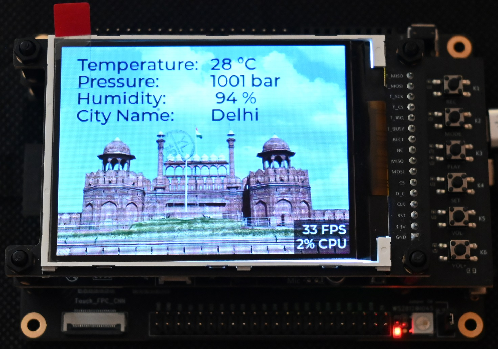
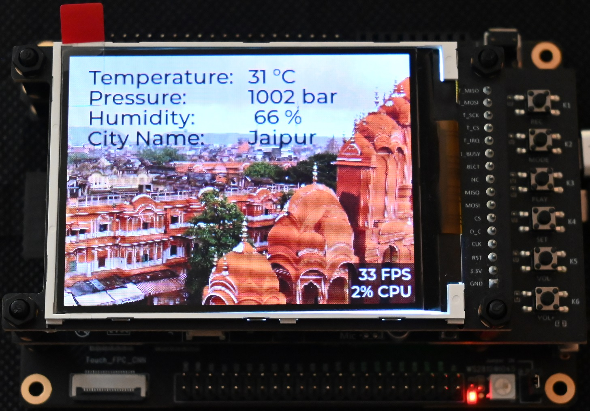
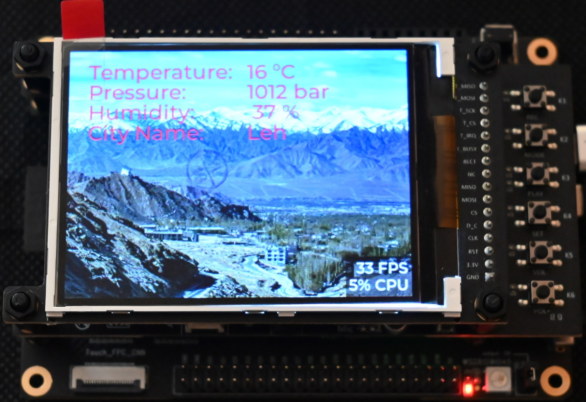
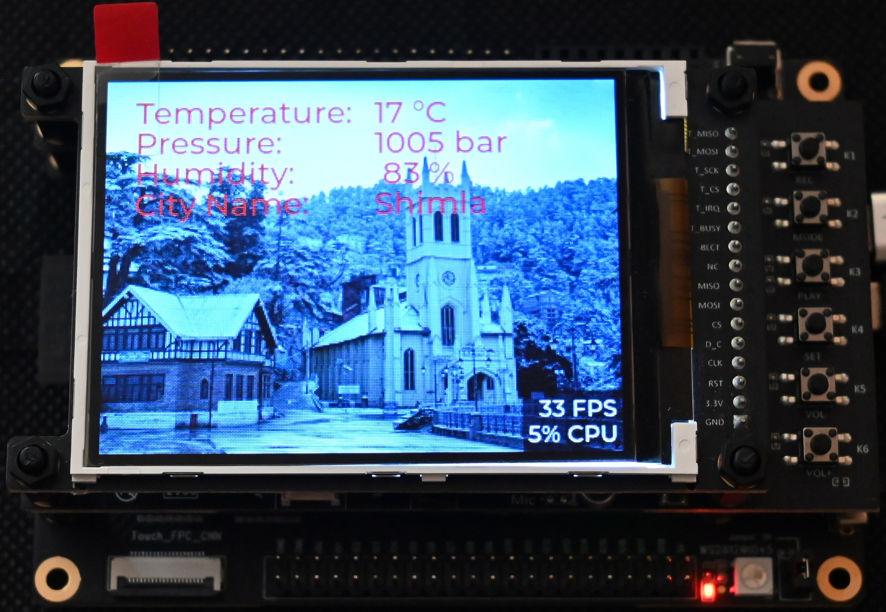
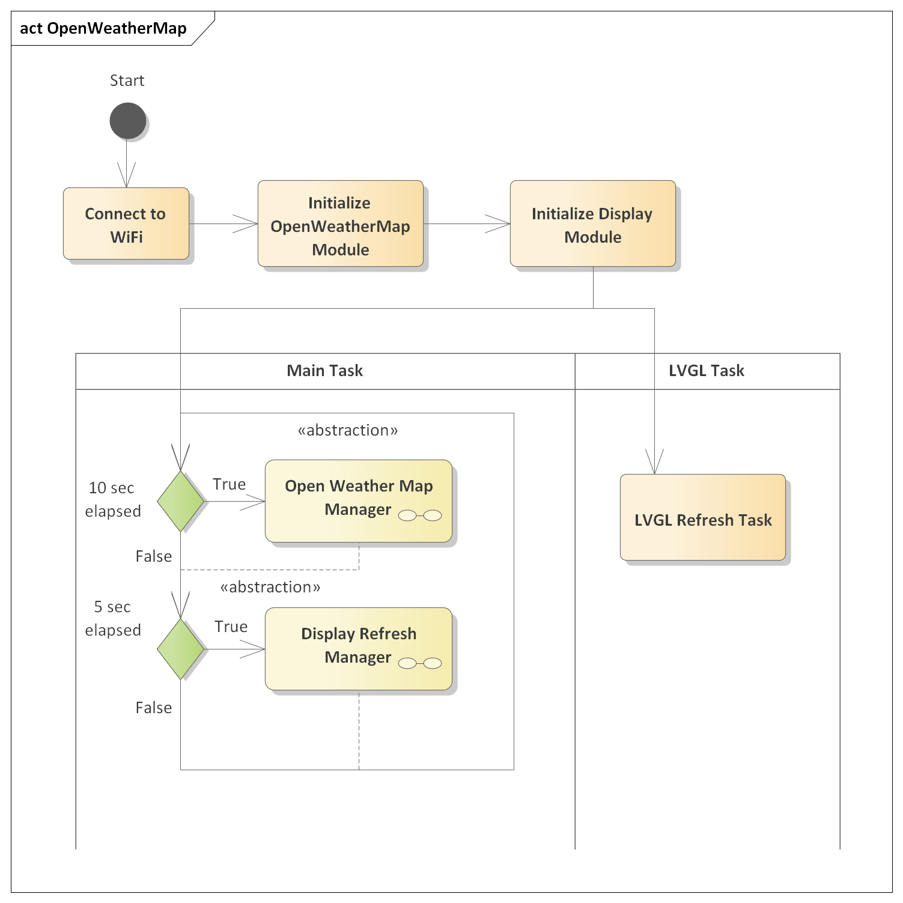
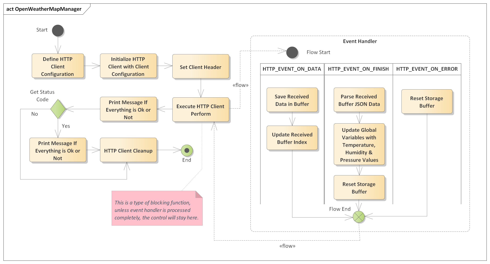
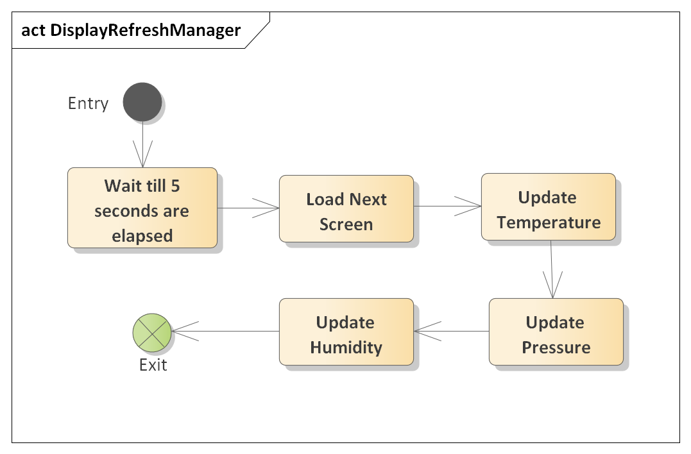

Sensor Less Weather Station using Open Weather Map Website and LVGL
====================

<!-- ](docs/pcbway.png) -->
<a href="https://pcbway.com/g/a8XEUi"></a>


In this post I will show you guys, how to make a Sensor less Weather Station using Open Weather Map website and display the temperature, humidity and pressure values on the LCD along with the city image and name, as shown in the below images.

<!--    -->
  

<!--    -->
  

<!--    -->
  

<!--    -->
  


## Open Weather Map
OpenWeatherMap is an online service, owned by OpenWeather Ltd, that provides global weather data via API, including current weather data, forecasts, nowcasts and historical weather data for any geographical location. 

The company provides a minute-by-minute hyperlocal precipitation forecast for any location. The convolutional machine learning model is used to utilise meteorological broadcast services and data from airport weather stations, on-ground radar stations, weather satellites, remote sensing satellites, METAR and automated weather stations.

The company has more than 2 million customers, ranging from independent developers to Fortune 500 companies.

I am not going to share how to create an account on the "OpenWeatherMap" website, but in case you want to have some more information, you can read the above-mentioned post and also have a look at the mentioned videos in that post.

Let's say you wanted to get the weather information of the "Leh" city in India, you can simply type the following line in your web browser and you get the JSON data, as shown below.

The following is the API Key:
```
http://api.openweathermap.org/data/2.5/weather?q=leh&appid={API_KEY}=metric
```

And the following is the response.
```
{
  "coord":{"lon":77.5833,"lat":34.1667},
  "weather":
  [
    {"id":804,"main":"Clouds","description":"overcast clouds","icon":"04n"}
  ],
  "base":"stations",
  "main":{"temp":9.05,"feels_like":8.67,"temp_min":9.05,"temp_max":9.05,"pressure":1016,"humidity":91,"sea_level":1016,"grnd_level":676},
  "visibility":9138,
  "wind":{"speed":1.41,"deg":226,"gust":1.33},
  "clouds":{"all":100},"dt":1688915861,
  "sys":{"country":"IN","sunrise":1688859900,"sunset":1688911451},
  "timezone":19800,"id":1264976,"name":"Leh","cod":200
}
```

And then using a JSON parser we can decode this data to extract the "temperature", "humidity" and pressure information, which can be displayed on the 3.2-inch LCD using the LVGL graphics library.

### Software Architecture
<!--  -->
  

The above Activity Diagram is used to explain the steps of this small project.

* The first step is to connect with the router so that ESP32 can be connected to the internet to get the data from the "OpenWeatherMap" website.
* In the second step, the "OpenWeatherMap" software module is initialized, which doesn't do much, it will just initialize the names of the city (this also can be configured, but I have kept them hard-coded inside the module)
* In the third step, the "Display" software module is initialized, it will initialize the 3.2 Inch LCD and also initialize the LVGL Graphics Library, in the background a FreeRTOS task is created and this task keeps on refreshing the display by calling the LVGL functions.
* So now only two FreeRTOS tasks running, one is "app_main" which is also known as the main task and another task is the "LVGL" task which is hidden from us directly, ideally we can create another task also dedicated to "Open Weather Map" but I avoided to do so, as of now.

#### Main Code
```C
// Main Program Starts from Here
void app_main(void)
{
  int64_t current_time = 0;
  esp_err_t ret = nvs_flash_init();
  if (ret == ESP_ERR_NVS_NO_FREE_PAGES || ret == ESP_ERR_NVS_NEW_VERSION_FOUND)
  {
    ESP_ERROR_CHECK(nvs_flash_erase());
    ret = nvs_flash_init();
  }
  ESP_ERROR_CHECK(ret);

  // Connect to Wireless Access Point
  ret = connect_wifi();
  if( ret == WIFI_SUCCESS )
  {
    // Initialize the OpenWeatherMap module
    openweathermap_init();
    // Initialize the Display Manager
    display_init();
    openweathermap_timestamp = esp_timer_get_time();
    display_timestamp = esp_timer_get_time();

    while( true )
    {
      current_time = esp_timer_get_time();

      // OpenWeatherMap Management
      if( (current_time - openweathermap_timestamp) > OPENWEATHERMAP_MNG_EXEC_RATE )
      {
        openweathermap_timestamp = current_time;
        openweathermap_mng();
      }

      // Display Management
      if( (current_time - display_timestamp) > DISPLAY_MNG_EXEC_RATE )
      {
       display_timestamp = current_time;
       display_mng();
      }
      vTaskDelay(MAIN_TASK_EXEC_RATE / portTICK_PERIOD_MS);
    }
  }
}
```
### Open Weather Map Software Module



The above Activity Diagram shows how the "OpenWeather Map" software module us handling the different cases to send the HTTP GET requests and get the data from the "Open Weather Map" website using API calls.

And once the data is received which is in JSON format, the "cJSON" inbuilt library is used to extract the "Temperature", "Pressure" and "Humidity" data from it, and saved in the global structures.

```C
void openweathermap_init(void)
{
  // Initialize the City Names
  strcpy(city_weather[0].city_name, "Delhi");
  strcpy(city_weather[1].city_name, "Shimla");
  strcpy(city_weather[2].city_name, "Jaipur");
  strcpy(city_weather[3].city_name, "Leh");
}

// OpenWeatherMap Manager
void openweathermap_mng(void)
{
  if( request_in_process == false )
  {
    request_in_process = true;
    openweathermap_send_request();
  }
}

// OpenWeatherMap Task (optional, if we don't want to use above two functions manually)
void openweathermap_task(void *pvParameters)
{
  openweathermap_init();
  for(;;)
  {
    openweathermap_mng();
    vTaskDelay(HTTP_REQ_EXEC_RATE/portTICK_PERIOD_MS);

  }
  vTaskDelete(NULL);
}

// Private Function Definitions
static void openweathermap_send_request(void)
{
  char openweathermap_url[200];
  snprintf( openweathermap_url, sizeof(openweathermap_url), \
            "%s%s%s", CLIENT_REQ_PRE, city_weather[city_weather_index].city_name, CLIENT_REQ_POST);

  esp_http_client_config_t config =
  {
    .url = openweathermap_url,
    .method = HTTP_METHOD_GET,
    .event_handler = openweathermap_event_handler,
  };

  // ESP_LOGI(TAG, "URL:%s", openweathermap_url);
  ESP_LOGI(TAG, "Free Heap: %lu, Minimum Heap: %lu", esp_get_free_heap_size(), esp_get_minimum_free_heap_size() );

  esp_http_client_handle_t client = esp_http_client_init(&config);
  esp_http_client_set_header(client, CLIENT_KEY, CLIENT_VALUE);
  esp_err_t err = esp_http_client_perform(client);
  if( err == ESP_OK )
  {
    int status = esp_http_client_get_status_code(client);
    if(status == 200)
    {
      ESP_LOGI(TAG, "Message Sent Successfully");
    }
    else
    {
      ESP_LOGI(TAG, "Message Sent Failed");
    }
  }
  else
  {
    ESP_LOGI(TAG, "Message Sent Failed");
  }
  esp_http_client_cleanup(client);
}

static esp_err_t openweathermap_event_handler(esp_http_client_event_t *event)
{
  switch(event->event_id)
  {
    case HTTP_EVENT_ON_DATA:
      // Copy the Data to response_data buffer
      memcpy(response_data+response_data_idx, event->data, event->data_len);
      // Update the Length
      response_data_idx += event->data_len;
      break;
    case HTTP_EVENT_ON_FINISH:
      // Decode/Parse the weather data from the response data
      openweathermap_get_weather(response_data, &city_weather[city_weather_index]);
      // reset the response buffer and also the length to initial state
      openweathermap_reset_buffer();
      ESP_LOGI( TAG, "City=%s, Temp=%d, Pressure=%d, Humidity=%d", \
                city_weather[city_weather_index].city_name,   \
                city_weather[city_weather_index].temperature, \
                city_weather[city_weather_index].pressure,    \
                city_weather[city_weather_index].humidity);
      city_weather_index++;
      // Reset back to Initial Position
      if( city_weather_index >= NUM_OF_CITIES )
      {
        city_weather_index = 0;
      }
      // Free the system for next requests
      request_in_process = false;
      break;
    case HTTP_EVENT_ERROR:
      // In case of Error, exit
      openweathermap_reset_buffer();
      // Free the system for next requests
      request_in_process = false;
      break;
    default:
      break;
  }
  return ESP_OK;
}

```

### Display Refreshing
<!--  -->


And then in another function "display_mng" is used to update the "Temperature", "Pressure", "Humidity" and "City Name" with the city image on the display using LVGL functions.

## References
Took Some Help from the following Links:  
[ESP IDF Open Weather Map](https://github.com/ESP32Tutorials/ESP32-ESP-IDF-OpenWeatherMap-API/tree/main/main)

[ESP32 IDF Open Weather Map](https://esp32tutorials.com/esp32-esp-idf-openweathermap-api-sensorless-weather-station/#more-3008)

[HTTP Client ESP32](https://www.youtube.com/watch?v=_dRrarmQiAM)

### Issues
Faced an issue
```
esp-tls-mbedtls: No server verification option set in esp_tls_cfg_t structure
```
Which is fixed using this link:  
[ESP TLS MBEDTLS GitHub Issue Solution](https://github.com/zonmen/IndoorSolution-esp32/issues/1)
```
CONFIG_ESP_TLS_INSECURE=y
CONFIG_ESP_TLS_SKIP_SERVER_CERT_VERIFY=y
```
