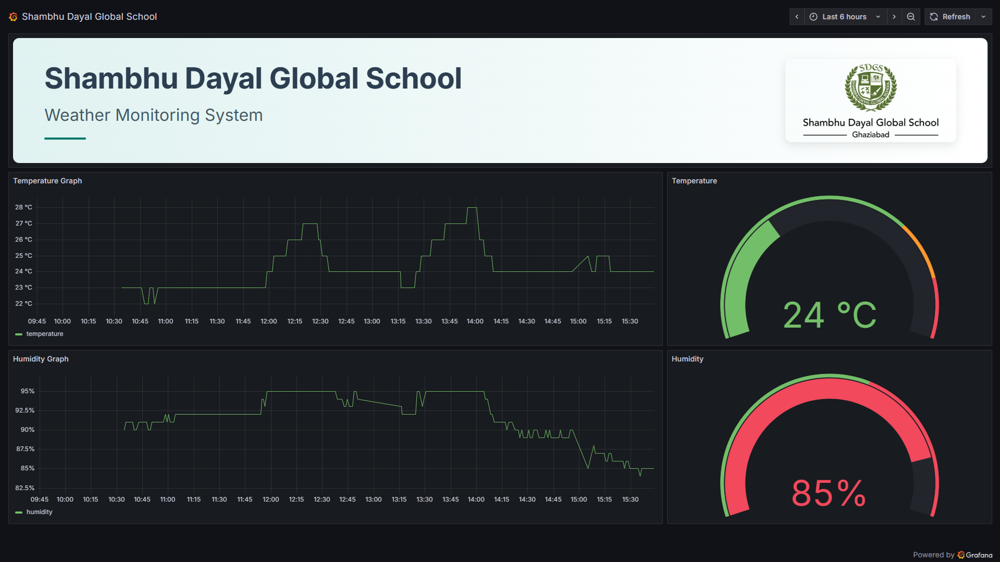

# Important Information
ESP32S3 is sensing the Temperature and Humidity Values from DHT11 sensor, and then updating these values on TFT display and also sending this data to InfluxDB cloud.

The Grafana then fetches this data from the InfluxDB cloud, and visualizes it as shown below.



The top logo of is generated using the `Text` plugin and writing the `html` code inside it, altough `markdown` option was also available, but I preferred using `html` for better beautification.

The following is the `html` code which is generated with the help of `CoPilot`.  
```html
<div style="display: flex; justify-content: space-between; align-items: center; background: linear-gradient(to right, #e0f2f1, #ffffff); font-family: 'Segoe UI', Roboto, sans-serif; color: #2c3e50; padding: 40px 60px; border-radius: 12px;">
  
  <!-- Left Side: Text Content -->
  <div style="flex: 1; text-align: left;">
    <h1 style="font-size: 56px; margin: 0 0 20px; font-weight: 700;">Shambhu Dayal Global School</h1>
    <h2 style="font-size: 32px; font-weight: 400; color: #455a64; margin: 0;">Weather Monitoring System</h2>
    <div style="margin-top: 24px; width: 80px; height: 4px; background-color: #00796b; border-radius: 2px;"></div>
  </div>
  
  <!-- Right Side: Logo -->
  <div style="flex-shrink: 0;">
    
  </div>
</div>
```

I also placed the working `Grafana` Dashboard inside the same folder for reference and future usage.  